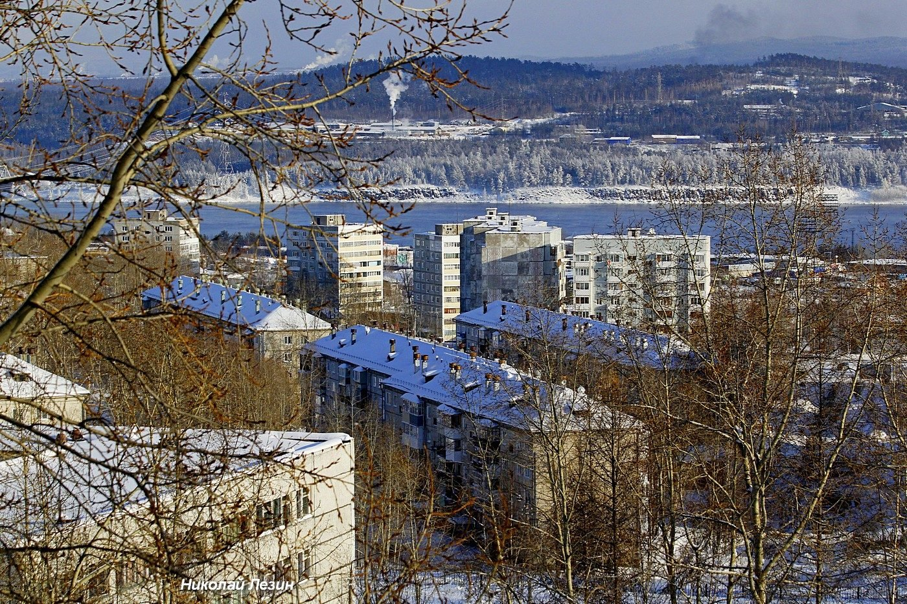

# Архивная коллекция: культурные сайты города Усть-Илимск 

## **1\. Общее описание коллекции**

Данная архивная коллекция представляет собой собрание сайтов, посвящённых культурной жизни города Усть-Илимска Иркутской области. В коллекцию вошли ресурсы музеев, дворцов культуры и других культурных учреждений города.

Усть-Илимск – небольшой (менее 80 тысяч жителей) город на севере Иркутской области, основанный в 1966 году. 

[](./ui.png)

## **2\. Причины создания коллекции**

Коллекция создана для сохранения и популяризации культурного наследия Усть-Илимска. Она может послужить удобным инструментом для изучения культурной жизни города. 

Сайты, включённые в коллекцию, отражают разнообразие культурных инициатив, имеющих место в городе.

Сохранение данной коллекции позволит обеспечить более надёжный доступ к информации о культурной жизни Усть-Илимска. В условиях быстрого развития цифровых технологий и постоянных изменений в интернет-пространстве, многие сайты исчезают или сильно изменяются. Архивирование позволит сохранить важные исторические и культурные данные для будущих поколений, а также обеспечит доступ к ним для исследователей и интересующихся.

## **3\. Ссылка на содержимое коллекции**

[https://disk.yandex.ru/d/esYpVEvTnpyCnA](https://disk.yandex.ru/d/esYpVEvTnpyCnA) 

## **4\. Технические данные коллекции**

### **Общие данные**

**Тема коллекции:** культура, краеведение, городская жизнь, Усть-Илимск

**Число сайтов в архиве:** 5

**Общий размер коллекции:** около 6 Гб

**Дата архивации сайтов:** 04.12.2024—05.12.2024

### **Краткая информация о формате хранения коллекции**

Архив каждого сайта представляет собой директорию с html-страницами и медиаконтентом (изображения, документы в формате pdf и проч.), которые собраны в единый архивный файл специального формата [WARC](https://ru.wikipedia.org/wiki/Web_ARChive).

Содержимое файлов WARC можно просматривать с помощью специализированных программ или библиотек (например, [warcio](https://pypi.org/project/warcio/)) или онлайн на сайте [https://replayweb.page](https://replayweb.page/).

### **Метод сбора коллекции**

Сайты были загружены и сохранены в формате warc с помощью unix-утилиты [Wget](https://ru.wikipedia.org/wiki/Wget) c указанием соответствующих параметров. Ниже приведён пример команды для загрузки одного из сайтов коллекции.

```
wget "https://uikovcheg.narod.ru/" --mirror -k --warc-cdx=on  --warc-file="ui_kovcheg" --no-warc-compression
```
Для проверки функциональности полученных архивы использовался сервис [ReplayWeb.page](http://ReplayWeb.page).

Анализ архивопригодности сайтов проведён с помощью инструмента [ArchiveReady](https://archiveready.com/),

Анализ метаданных архивов проведён с помощью пакета [metawarc](https://github.com/datacoon/metawarc).

## **5\. Элементы коллекции**

| Сайт | Владелец сайта | Содержимое сайта | Размер |
| :---- | :---- | :---- | :---- |
| [**uigallery.ru**](http://uigallery.ru) | Картинная галерея города Усть-Илимска | информация об организации афиша виртуальная выставка документы | 2,5 Гб |
| [**uigdk.ru**](http://uigdk.ru) | Городской дворец культуры “Дружба” (Усть-Илимск) | информация об организации афиша сведения о творческих коллективах города | 300 Мб |
| [**uikovcheg.narod.ru**](http://uikovcheg.narod.ru) | Православный храм во имя Всех Cвятых, в Земле Российской просиявших (Усть-Илимск)  | история храма расписание служб литература | 30 Мб |
| [**дк-наймушина.рф**](http://дк-наймушина.рф)| Городской дворец культуры им И.И. Наймушина (Усть-Илимск) | информация об организации афиша сведения о творческих коллективах города | 2,5 Гб |
| [**илимский-музей.рф**](http://илимский-музей.рф) | Краеведческий музей города Усть-Илимска | информация об организации план мероприятий сведения из истории города и края | 1 Гб |

## **6\. Контакты**

[epdunenkov@edu.hse.ru](mailto:epdunenkov@edu.hse.ru)

## **7\. Условия использования коллекции**

Данная работа может свободно распространяться по лицензии CC0 1.0 Universal
