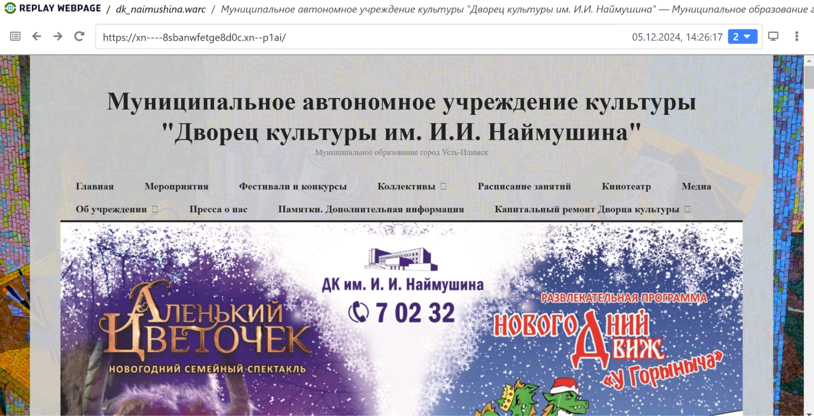

# Архив сайта дк-наймушина.рф 

## **1\. Информация о сайте**

[]./replay_web.png)

Сайт Усть-Илимского дворца культуры имени Наймушина публикует афишу предстоящих мероприятий, информацию о кружках и секциях, работающих в ДК, а также сведения об истории и деятельности учреждения. На сайте можно найти подробности о концертах, спектаклях, выставках и других культурных событиях, проводимых в ДК им. Наймушина.

**Технические детали:**

**Движок сайта:** Wordpress 

**Основное содержание сайта:** информация об организации, афиша, сведения о творческих коллективах города

**Размер архива:** 2,5 Гб

## **2\. Анализ архивопригодности**

\[\!\[Результаты проверки\](./archive\_ready.png)\]./archive\_ready.png)

На сервисе ArchiveReady сайт получил общую оценку пригодности для архивирования 48%, продемонстрировав относительно хорошие результаты по метрикам Metadata и Standards Compliance и получив низкие оценки по Accessibility и Cohesion, что указывает на технические проблемы, которые могут возникнуть при архивации. В частности, среди проблем указаны следующие:

* invalid CSS  
* remote CSS   
* inline JavaScript code  
* remote images  
* invalid RSS  
* no sitemap.xml

Эти проблемы могут помешать долговременному сохранению и обеспечению доступности архива сайта.

## **3\. Анализ метаданных**

Результаты выполнения команды ***metawarc analyze***   
2024-12-17 18:22:42,563 \- root \- DEBUG \- Preparing /content/drive/MyDrive/dk\_naimushina.warc  
2024-12-17 18:23:27,946 \- root \- INFO \- Processed 10000 records  
mimes                                                                      files        size          share  
\-----------------------------------------------------------------------  \-------  \----------  \-------------  
image/jpeg                                                                  6198  1771544157   67.4306  
application/pdf                                                              287   451106604   17.1706  
text/html                                                                   3699   361288435   13.7518  
text/calendar                                                                506    19625311    0.747002  
application/json                                                             819     9265400    0.352671  
image/png                                                                     48     2622969    0.0998386  
application/javascript                                                        58     2221788    0.0845684  
text/xml                                                                     367     1800818    0.0685449  
image/webp                                                                     6     1762591    0.0670899  
image/svg+xml                                                                 18     1744413    0.0663979  
font/ttf                                                                       9     1101849    0.0419399  
text/css                                                                      45      982986    0.0374156  
application/vnd.ms-fontobject                                                 10      739984    0.0281662  
application/rss+xml                                                          228      639817    0.0243535  
font/woff2                                                                     7      465863    0.0177322  
font/woff                                                                      5      223629    0.00851204  
application/vnd.openxmlformats-officedocument.wordprocessingml.document        3       54716    0.00208267  
image/gif                                                                      6       16519    0.000628766  
text/plain                                                                     3        1650    6.28043e-05  
\#total                                                                     12322  2627209499  100

Мы можем видеть, что наибольшую долю на диске занимают изображения и pdf-файлы.

Результаты работы команды ***metawarc metadata \--output*** можно найти в файле формата jsonl в текущей директории. Метаданные большей части файлов были успешно сохранены при выполнении команды.

Результаты выполнения команд ***metawarc index*** и ***metawarc stats \-m mimes***

*Group by mime type*                                         
┏━━━━━━━━━━━━━━━━━━━━━━━━━━━━━━━━━━━━━━━━━━━━━━━━━━━━━━━━━━━━━━━━━━━━━━━━━┳━━━━━━━━━━━━┳━━━━━━━┓  
┃ **mime**                                                                   ┃ **size**      ┃ **count** ┃  
┡━━━━━━━━━━━━━━━━━━━━━━━━━━━━━━━━━━━━━━━━━━━━━━━━━━━━━━━━━━━━━━━━━━━━━━━━━╇━━━━━━━━━━━━╇━━━━━━━┩  
│ None                                                                   │ 1614783   │   36 │  
│ application/font-sfnt                                                  │ 975958    │    7 │  
│ application/font-woff                                                  │ 122043    │    2 │  
│ application/javascript                                                 │ 15841988  │  136 │  
│ application/javascript; charset=UTF-8                                  │ 458748    │   11 │  
│ application/json; charset=UTF-8                                        │ 12251927  │  868 │  
│ application/msword                                                     │ 308176    │    8 │  
│ application/pdf                                                        │ 698699559 │  385 │  
│ application/rss+xml; charset=UTF-8                                     │ 1265181   │  247 │  
│ application/vnd.ms-fontobject                                          │ 4031191   │   76 │  
│ application/vnd.openxmlformats-officedocument.wordprocessingml.document │ 372263    │   20 │  
│ application/x-font-ttf                                                 │ 2272663   │   30 │  
│ application/x-font-woff                                                │ 267667    │    4 │  
│ application/zip                                                        │ 442934    │    1 │  
│ font/ttf                                                               │ 1258053   │   11 │  
│ font/woff                                                              │ 322096    │    7 │  
│ font/woff2                                                             │ 465863    │    7 │  
│ image/gif                                                              │ 239336    │   80 │  
│ image/jpeg                                                             │ 3503759318 │ 9312 │  
│ image/png                                                              │ 13071875  │  168 │  
│ image/svg+xml                                                          │ 7841523   │   80 │  
│ image/webp                                                             │ 1762591   │    6 │  
│ text/calendar; charset=UTF-8                                           │ 19664831  │  509 │  
│ text/css                                                               │ 3854057   │  136 │  
│ text/html                                                              │ 50025     │  111 │  
│ text/html; charset=UTF-8                                               │ 400341107 │ 4227 │  
│ text/html; charset=iso-8859-1                                          │ 10593     │   17 │  
│ text/html; charset=windows-1251                                        │ 323297    │  326 │  
│ text/plain                                                             │ 578       │    1 │  
│ text/plain; charset=UTF-8                                              │ 1957      │    2 │  
│ text/plain; charset=utf-8                                              │ 2452      │    5 │  
│ text/plain;charset=UTF-8                                               │ 259       │    1 │  
│ text/plain;charset=windows-1251                                        │ 350       │    1 │  
│ text/xml                                                               │ 1288      │    1 │  
│ text/xml; charset=UTF-8                                                │ 1845904   │  380 │  
│ text/xml; charset=utf-8                                                │ 33318     │    1 │  
│ text/xml;charset=utf-8                                                 │ 14092154  │    1 │  
│ video/mp4                                                              │ 1026529269 │   21 │  
└─────────────────────────────────────────────────────────────────────────┴────────────┴───────┘
