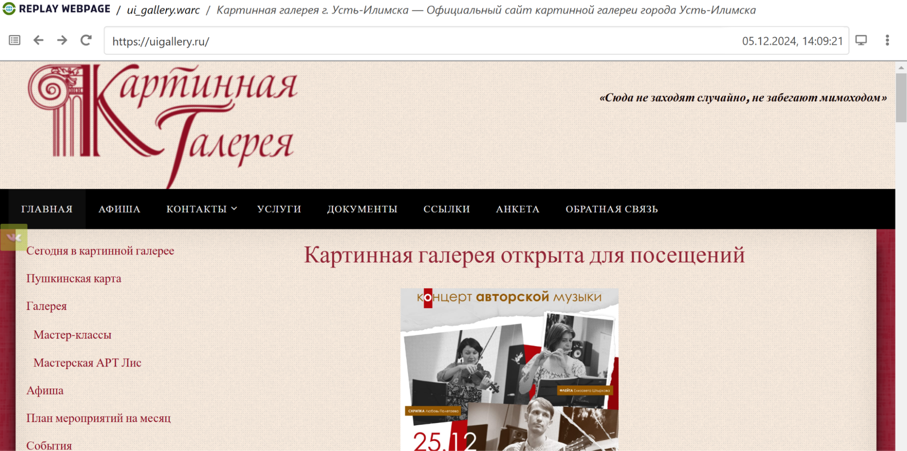
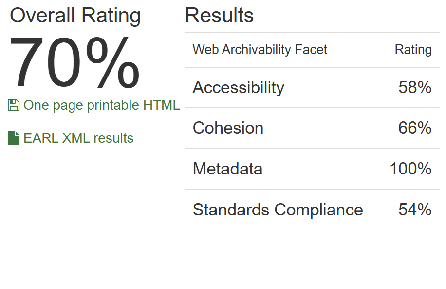

# Архив сайта uigallery.ru 

## **1\. Информация о сайте**

[](replay_web1.png)

Сайт картинной галереи города Усть-Илимска. Данный сайт предоставляет информацию о деятельности галереи, её экспозициях, выставках и мероприятиях. На сайте можно найти сведения о художниках, чьи работы представлены в коллекции, а также фотографии экспонатов и анонсы будущих событий. Ресурс служит информационным порталом для посетителей и любителей искусства города Усть-Илимска.

**Технические детали:**

**Движок сайта:** Wordpress 

**Основное содержание сайта:** информация об организации, афиша, виртуальная выставка, документы

**Размер архива:** 2,5 Гб

## **2\. Анализ архивопригодности**

[](archive_ready.png)

На сервисе ArchiveReady сайт получил общую оценку пригодности для архивирования 70%, продемонстрировав отличные результаты по метрике Metadata и хорошие результаты по остальным метрикам. Среди потенциальных проблем для архивации указаны следующие:

* invalid CSS
* remote CSS 
* inline JavaScript code 
* remote images
* no sitemap.xml found

Эти проблемы могут помешать долговременному сохранению и обеспечению доступности архива сайта.

## **3\. Анализ метаданных**

Результаты выполнения команды ```metawarc analyze```:

<pre>
2024-12-17 13:08:30,116 - root - DEBUG - Preparing /content/drive/MyDrive/ui_gallery.warc
mimes                            files        size          share
-----------------------------  -------  ----------  -------------
image/jpeg                        2272  1647546444   65.8601
video/mp4                           14   730180729   29.1887
application/pdf                     56    86038944    3.43937
text/html                          445     9761072    0.390195
application/javascript              15     9459238    0.378129
image/svg+xml                       29     5188023    0.207389
image/png                           31     3947195    0.157788
application/vnd.ms-fontobject       58     2701382    0.107987
application/x-font-ttf              30     2272663    0.0908489
                                    31     1232207    0.049257
text/css                            35     1184751    0.04736
application/json                    22      767736    0.03069
application/rss+xml                  8      561595    0.0224495
application/zip                      1      442934    0.0177061
application/x-font-woff              4      267667    0.0106999
image/gif                            5       33701    0.00134718
text/plain                           2         684    2.73426e-05
#total                            3058  2501586965  100
</pre>

Мы можем видеть, что наибольшую долю на диске занимают изображения и видео.

Результаты выполнения команды ```metawarc metadata \--output``` можно найти в файле формата jsonl в текущей директории. Метаданные большей части файлов были успешно сохранены при выполнении команды.

Результаты выполнения команд ```metawarc index``` и ```metawarc stats \-m mimes```

<pre>
  Group by mime type                                       
┏━━━━━━━━━━━━━━━━━━━━━━━━━━━━━━━━━━━━━━━━━━━━━━━━━━━━━━━━━━━━━━━━━━━━━━━━━┳━━━━━━━━━━━━┳━━━━━━━┓
┃ mime                                                                    ┃ size       ┃ count ┃
┡━━━━━━━━━━━━━━━━━━━━━━━━━━━━━━━━━━━━━━━━━━━━━━━━━━━━━━━━━━━━━━━━━━━━━━━━━╇━━━━━━━━━━━━╇━━━━━━━┩
│ None                                                                    │ 1614783    │   36  │
│ application/font-sfnt                                                   │ 975958     │    7  │
│ application/font-woff                                                   │ 122043     │    2  │
│ application/javascript                                                  │ 13620200   │   78  │
│ application/javascript; charset=UTF-8                                   │ 458748     │   11  │
│ application/json; charset=UTF-8                                         │ 2986527    │   49  │
│ application/msword                                                      │ 308176     │    8  │
│ application/pdf                                                         │ 247592955  │   98  │
│ application/rss+xml; charset=UTF-8                                      │ 625364     │   19  │
│ application/vnd.ms-fontobject                                           │ 3291207    │   66  │
│ application/vnd.openxmlformats-officedocument.wordprocessingml.document │ 317547     │   17  │
│ application/x-font-ttf                                                  │ 2272663    │   30  │
│ application/x-font-woff                                                 │ 267667     │    4  │
│ application/zip                                                         │ 442934     │    1  │
│ font/ttf                                                                │ 156204     │    2  │
│ font/woff                                                               │ 98467      │    2  │
│ image/gif                                                               │ 222817     │   74  │
│ image/jpeg                                                              │ 1732215161 │ 3114  │
│ image/png                                                               │ 10448906   │  120  │
│ image/svg+xml                                                           │ 6097110    │   62  │
│ text/calendar; charset=UTF-8                                            │ 39520      │    3  │
│ text/css                                                                │ 2871071    │   91  │
│ text/html                                                               │ 50025      │  111  │
│ text/html; charset=UTF-8                                                │ 39059993   │  538  │
│ text/html; charset=iso-8859-1                                           │ 3519       │    8  │
│ text/html; charset=windows-1251                                         │ 323050     │  325  │
│ text/plain                                                              │ 578        │    1  │
│ text/plain; charset=UTF-8                                               │ 1957       │    2  │
│ text/plain; charset=utf-8                                               │ 1152       │    3  │
│ text/plain;charset=UTF-8                                                │ 259        │    1  │
│ text/xml                                                                │ 1288       │    1  │
│ text/xml; charset=UTF-8                                                 │ 45086      │   13  │
│ text/xml; charset=utf-8                                                 │ 33318      │    1  │
│ text/xml;charset=utf-8                                                  │ 14092154   │    1  │
│ video/mp4                                                               │ 1026529269 │   21  │
└─────────────────────────────────────────────────────────────────────────┴────────────┴───────┘

</pre>
