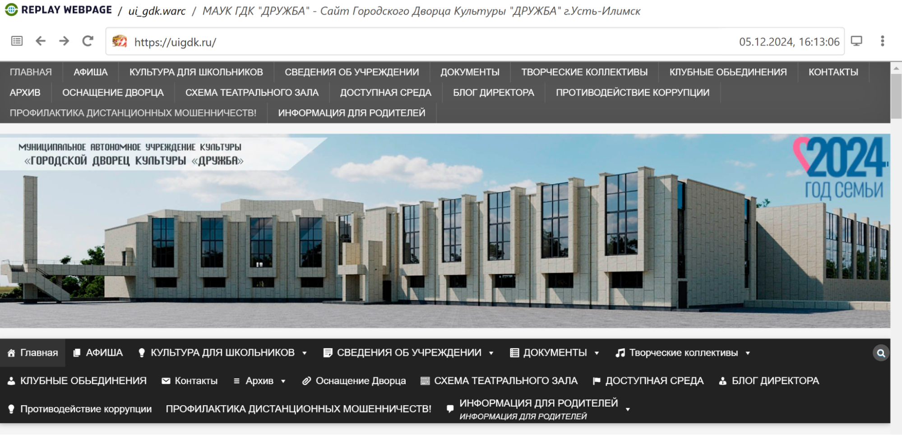
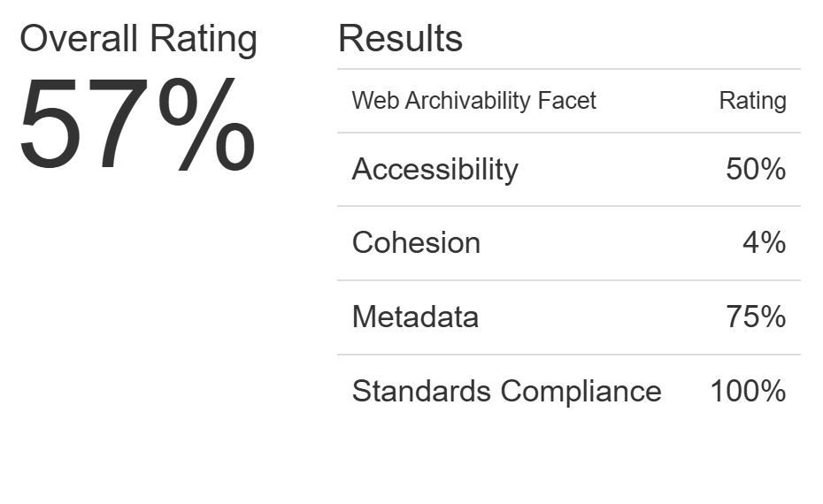

# Архив сайта uigdk.ru 

## **1\. Информация о сайте**

[](replay_web.png))

Сайт Усть-Илимского дворца культуры «Дружба» содержит информацию о деятельности ДК, афишу предстоящих мероприятий, расписание кружков и секций. Сайт служит удобным источником информации для жителей Усть-Илимска, желающих узнать о культурной жизни города.

**Технические детали:**

**Движок сайта:** Wordpress 

**Основное содержание сайта:** информация об организации, афиша, сведения о творческих коллективах города


**Размер архива:** 300 Мб

## **2\. Анализ архивопригодности**

[](archive_ready.png)

На сервисе ArchiveReady сайт получил общую оценку пригодности для архивирования 57%, продемонстрировав отличные результаты по метрике Standards Compliance, хорошие результаты по метрикам Metadata и Accessibility и 0% по метрике Cohesion. Среди потенциальных проблем для архивации указаны следующие:

* invalid CSS
* invalid links
* remote CSS
* remote scripts
* inline JavaScript code 
* HTTP caching headers are not available
* remote images
* invalid RSS
* no sitemap.xml found

Эти проблемы могут помешать долговременному сохранению и обеспечению доступности архива сайта.

## **3\. Анализ метаданных**

Результаты выполнения команды ```metawarc analyze```:

<pre>
2024-12-17 12:38:18,053 - root - DEBUG - Preparing ui_gdk.warc
mimes                                                                      files      size          share
-----------------------------------------------------------------------  -------  --------  -------------
text/html                                                                    184  29598755   31.8785
application/pdf                                                                2  25397235   27.3533
image/jpeg                                                                   116  16349082   17.6083
text/xml                                                                       2  14125472   15.2134
application/javascript                                                        60   2255239    2.42894
text/css                                                                      35    985659    1.06158
application/font-sfnt                                                          7    975958    1.05113
application/json                                                              11    806934    0.869085
image/png                                                                     26    676693    0.728812
image/svg+xml                                                                 10    565182    0.608713
application/vnd.ms-fontobject                                                  5    429831    0.462937
                                                                               5    382576    0.412042
application/font-woff                                                          2    122043    0.131443
application/rss+xml                                                            8     84154    0.0906356
application/vnd.openxmlformats-officedocument.wordprocessingml.document        2     53824    0.0579696
text/calendar                                                                  3     39520    0.0425639
text/plain                                                                     1       578    0.000622518
#total                                                                       479  92848735  100

</pre>

Мы можем видеть, что наибольшую долю на диске занимают html-файлы, pdf-файлы и изображения.

Результаты выполнения команды ```metawarc metadata \--output``` можно найти в файле формата jsonl в текущей директории. Метаданные большей части файлов были успешно сохранены при выполнении команды.

Результаты выполнения команд ```metawarc index``` и ```metawarc stats \-m mimes```

<pre>
 Group by mime type                                      
┏━━━━━━━━━━━━━━━━━━━━━━━━━━━━━━━━━━━━━━━━━━━━━━━━━━━━━━━━━━━━━━━━━━━━━━━━━┳━━━━━━━━━━┳━━━━━━━┓
┃ mime                                                                    ┃ size     ┃ count ┃
┡━━━━━━━━━━━━━━━━━━━━━━━━━━━━━━━━━━━━━━━━━━━━━━━━━━━━━━━━━━━━━━━━━━━━━━━━━╇━━━━━━━━━━╇━━━━━━━┩
│ None                                                                    │ 382576   │    5  │
│ application/font-sfnt                                                   │ 975958   │    7  │
│ application/font-woff                                                   │ 122043   │    2  │
│ application/javascript                                                  │ 2255239  │   60  │
│ application/javascript; charset=UTF-8                                   │ 458748   │   11  │
│ application/json; charset=UTF-8                                         │ 730658   │    4  │
│ application/pdf                                                         │ 1149241  │    2  │
│ application/rss+xml; charset=UTF-8                                      │ 43294    │    4  │
│ application/vnd.ms-fontobject                                           │ 429831   │    5  │
│ application/vnd.openxmlformats-officedocument.wordprocessingml.document │ 53824    │    2  │ 
│ image/gif                                                               │ 76199    │   57  │
│ image/jpeg                                                              │ 28494772 │  267  │
│ image/png                                                               │ 330845   │   44  │
│ image/svg+xml                                                           │ 594099   │   31  │
│ text/calendar; charset=UTF-8                                            │ 39520    │    3  │
│ text/css                                                                │ 1136490  │   54  │
│ text/html                                                               │ 50025    │  111  │
│ text/html; charset=UTF-8                                                │ 25891258 │  335  │
│ text/plain                                                              │ 578      │    1  │
│ text/plain; charset=UTF-8                                               │ 1957     │    2  │
│ text/xml; charset=UTF-8                                                 │ 975      │    1  │
│ text/xml; charset=utf-8                                                 │ 33318    │    1  │
│ text/xml;charset=utf-8                                                  │ 14092154 │    1  │
└─────────────────────────────────────────────────────────────────────────┴──────────┴───────┘

</pre>
