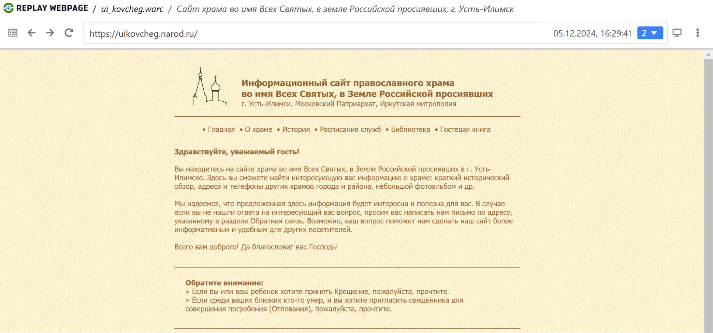
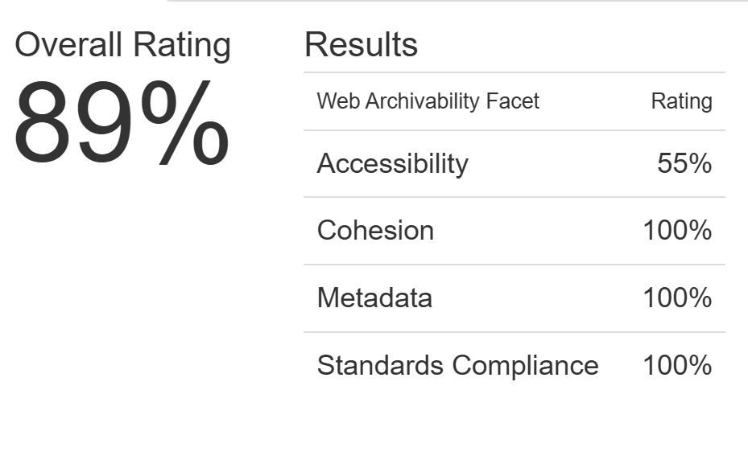

# Архив сайта uikovcheg.narod.ru 

## **1\. Информация о сайте**

[](replay_web.png)

Сайт православного храма Всех Святых в Усть-Илимске предоставляет информацию о жизни прихода, богослужениях, священнослужителях и духовных мероприятиях. На сайте можно найти расписание служб, объявления и новости храма, а также контактную информацию. Ресурс предназначен для прихожан и всех интересующихся деятельностью храма.

Сайт не обновляется с 2010 года.

**Технические детали:**

**Движок сайта:** uCoz 

**Основное содержание сайта:** история храма, расписание служб, литература

**Размер архива:** 30 Мб

## **2\. Анализ архивопригодности**

[](archive_ready.png)

На сервисе ArchiveReady сайт получил общую оценку пригодности для архивирования 89%, продемонстрировав хорошие результаты по всем метрикам. Среди потенциальных проблем, которые могут возникнуть при архивации, указаны следующие:

* invalid CSS  
* remote CSS 
* remote scripts
* inline JavaScript code
* no sitemap.xml found

## **3\. Анализ метаданных**

Результаты выполнения команды ```metawarc analyze```:
<pre>
2024-12-17 12:28:44,685 - root - DEBUG - Preparing ui_kovcheg.warc
mimes                     files      size         share
----------------------  -------  --------  ------------
image/jpeg                  134  10425506   68.7526
text/html                   248   3771416   24.8712
application/javascript       11    458748    3.02528
application/pdf               1    194562    1.28307
text/css                     19    150831    0.994678
image/gif                    57     76199    0.502506
image/png                    20     54695    0.360694
image/svg+xml                21     28917    0.190698
text/plain                    2      1957    0.0129057
text/xml                      1       975    0.00642978
#total                      514  15163806  100

</pre>

Мы можем видеть, что наибольшую долю на диске занимают изображения и html-файлы.

Результаты выполнения команды ```metawarc metadata \--output``` можно найти в файле формата jsonl в текущей директории. Метаданные большей части файлов были успешно сохранены при выполнении команды.

Результаты выполнения команд ```metawarc index``` и ```metawarc stats \-m mimes```

<pre>
*Group by mime type*                                         
┏━━━━━━━━━━━━━━━━━━━━━━━━━━━━━━━━━━━━━━━┳━━━━━━━━━━┳━━━━━━━┓
┃ mime                                  ┃ size     ┃ count ┃
┡━━━━━━━━━━━━━━━━━━━━━━━━━━━━━━━━━━━━━━━╇━━━━━━━━━━╇━━━━━━━┩
│ application/javascript; charset=UTF-8 │ 458748   │   11  │
│ application/pdf                       │ 194562   │    1  │
│ image/gif                             │ 76199    │   57  │
│ image/jpeg                            │ 22451632 │  218  │
│ image/png                             │ 54695    │   20  │
│ image/svg+xml                         │ 28917    │   21  │
│ text/css                              │ 150831   │   19  │
│ text/html                             │ 49579    │  110  │
│ text/html; charset=UTF-8              │ 3998957  │  210  │
│ text/plain; charset=UTF-8             │ 1957     │    2  │
│ text/xml; charset=UTF-8               │ 975      │    1  │
└───────────────────────────────────────┴──────────┴───────┘

</pre>
