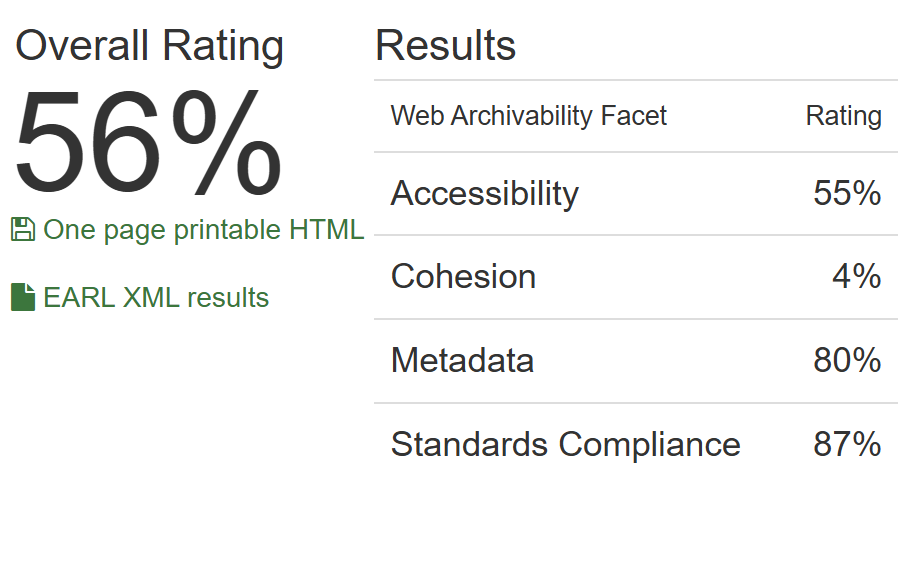

# Архив сайта илимский-музей.рф 

## **1\. Информация о сайте**

[](replay_web.png)

Сайт Усть-Илимского краеведческого музея знакомит посетителей с историей и культурой Усть-Илимска и его окрестностей. На сайте представлена информация о музейных экспозициях, выставках, проводимых мероприятиях, а также о фондах музея. Ресурс содержит фотографии экспонатов и материалы, рассказывающие об истории города и региона. Сайт служит информационным ресурсом для жителей и гостей Усть-Илимска, интересующихся историей и культурой края.

**Технические детали:**

**Движок сайта:** Wordpress 

**Основное содержание сайта:** информация об организации, план мероприятий, сведения из истории города и края


**Размер архива:** 1 Гб

## **2\. Анализ архивопригодности**

[](archive_ready.png)

На сервисе ArchiveReady сайт получил общую оценку пригодности для архивирования 56%, продемонстрировав хорошие результаты по всем метрикам, кроме Cohesion, что указывает на технические проблемы, которые могут возникнуть при архивации. В частности, среди проблем указаны следующие:

* invalid CSS  
* invalid HTML document 
* remote CSS
* remote scripts
* Inline JavaScript code
* remote images
* no sitemap.xml found

Эти проблемы могут помешать долговременному сохранению и обеспечению доступности архива сайта.

## **3\. Анализ метаданных**

Результаты выполнения команды ```metawarc analyze```:
<pre>
2024-12-17 12:41:43,364 - root - DEBUG - Preparing ui_museum.warc
mimes                                                                      files       size          share
-----------------------------------------------------------------------  -------  ---------  -------------
application/pdf                                                               18  106540011   60.3403
image/jpeg                                                                   575   56173945   31.8148
image/png                                                                     45    6170866    3.49495
text/html                                                                     83    3547560    2.00921
application/json                                                              19    1442758    0.817125
application/javascript                                                         2    1244825    0.705023
image/svg+xml                                                                  2     314988    0.178398
text/css                                                                       1     259333    0.146877
application/vnd.openxmlformats-officedocument.wordprocessingml.document       11     192109    0.108803
application/vnd.ms-fontobject                                                  3     159994    0.0906147
font/ttf                                                                       2     156204    0.0884682
image/gif                                                                     12     112917    0.063952
font/woff                                                                      2      98467    0.0557681
application/msword                                                             2      92660    0.0524792
text/xml                                                                      11      37363    0.021161
application/rss+xml                                                            7      20475    0.0115963
text/plain                                                                     2        727    0.000411746
#total                                                                       797  176565202  100
</pre>

Мы можем видеть, что наибольшую долю на диске занимают изображения и pdf-файлы.

Результаты выполнения команды ```metawarc metadata \--output``` можно найти в файле формата jsonl в текущей директории. Метаданные большей части файлов были успешно сохранены при выполнении команды.

Результаты выполнения команд ```metawarc index``` и ```metawarc stats \-m mimes```

<pre>
*Group by mime type*                                         
┏━━━━━━━━━━━━━━━━━━━━━━━━━━━━━━━━━━━━━━━━━━━━━━━━━━━━━━━━━━━━━━━━━━━━━━━━━┳━━━━━━━━━━━┳━━━━━━━┓
┃ mime                                                                    ┃ size      ┃ count ┃
┡━━━━━━━━━━━━━━━━━━━━━━━━━━━━━━━━━━━━━━━━━━━━━━━━━━━━━━━━━━━━━━━━━━━━━━━━━╇━━━━━━━━━━━╇━━━━━━━┩
│ None                                                                    │ 382576    │    5  │
│ application/font-sfnt                                                   │ 975958    │    7  │
│ application/font-woff                                                   │ 122043    │    2  │
│ application/javascript                                                  │ 4160962   │   63  │
│ application/javascript; charset=UTF-8                                   │ 458748    │   11  │
│ application/json; charset=UTF-8                                         │ 2218791   │   27  │
│ application/msword                                                      │ 308176    │    8  │
│ application/pdf                                                         │ 161554011 │   42  │
│ application/rss+xml; charset=UTF-8                                      │ 63769     │   11  │
│ application/vnd.ms-fontobject                                           │ 589825    │    8  │
│ application/vnd.openxmlformats-officedocument.wordprocessingml.document │ 317547    │   17  │
│ font/ttf                                                                │ 156204    │    2  │
│ font/woff                                                               │ 98467     │    2  │
│ image/gif                                                               │ 189116    │   69  │
│ image/jpeg                                                              │ 84668717  │  842  │
│ image/png                                                               │ 6501711   │   89  │
│ image/svg+xml                                                           │ 909087    │   33  │
│ text/calendar; charset=UTF-8                                            │ 39520     │    3  │
│ text/css                                                                │ 1686320   │   56  │
│ text/html                                                               │ 50025     │  111  │
│ text/html; charset=UTF-8                                                │ 29625490  │  426  │
│ text/plain                                                              │ 578       │    1  │
│ text/plain; charset=UTF-8                                               │ 1957      │    2  │
│ text/plain; charset=utf-8                                               │ 468       │    1  │
│ text/plain;charset=UTF-8                                                │ 259       │    1  │
│ text/xml                                                                │ 1288      │    1  │
│ text/xml; charset=UTF-8                                                 │ 45086     │   13  │
│ text/xml; charset=utf-8                                                 │ 33318     │    1  │
│ text/xml;charset=utf-8                                                  │ 14092154  │    1  │  
│ video/mp4                                                               │ 296348540 │    7  │
└─────────────────────────────────────────────────────────────────────────┴───────────┴───────┘
</pre>
